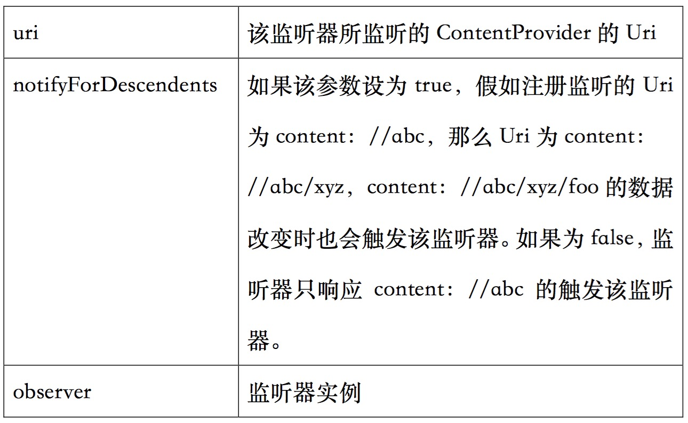

# 监听ContentProvider的数据改变
##ContentObserver简介

* 开发ContentProvider时，无论实现insert、delete、update方法中的哪一个只要导致ContentProvider里数据的改变，程序调用如下代码：
```
getContext( ).getcContentResolver( ).notifyChange(uri, null);
```

* 通知所有在该Uri上的监听者；该ContentProvider所共享的数据发生改变。

* 为监听指定ContentProvider的数据变化，需通过ContentResolver向指定Uri注册ContentObserver监听器，ContentResolver提供如下方法来注册监听器：

* registerContentObserver（Uri uri，boolean notifyForDescendents，ContentObserver observer）
其中的参数说明：




